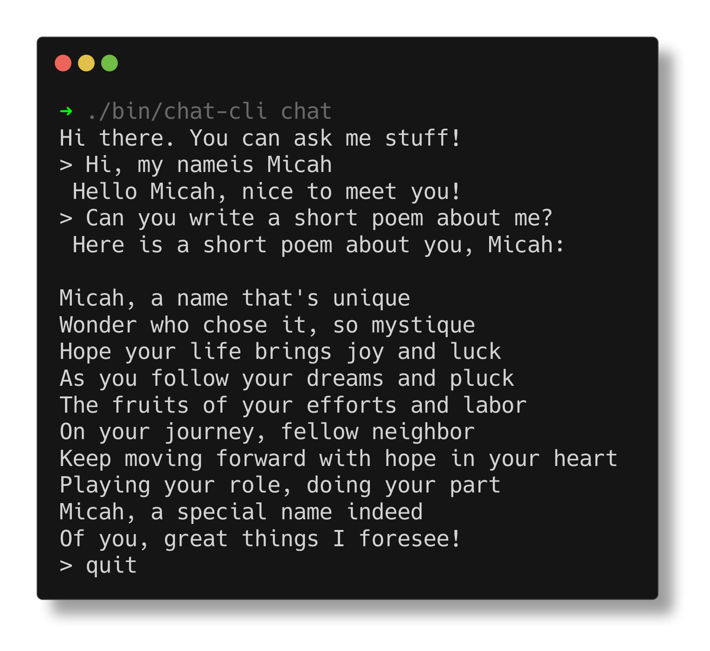

# chat-cli

A little terminal based program that talks to the Amazon Bedrock API. This is very much a work in progress experiment.

## Prerequisites

1. You will need an AWS account.
2. You will need to enable the LLMs you wish to use in Amazon Bedrock
3. You will need to run `aws config` from the command line to set up your default profile
4. You will need Go installed on your system

## Compile

    $ make

## Run

    $ ./bin/chat-cli <command> <args> <flags>

## Help

You can get help at anytime with the `--help` flag

## Use

There are currently two ways to interact with LLMs through this interface.

1. Send a single prompt from the command line using the `prompt` command
2. Start an interactive chat using the `chat` command

## Prompt

You can send a one liner prompt like this:

    $ ./bin/chat-cli prompt "How are you today?"

You can also pipe in a file as part of your prompt like this:

    $ cat myfile.go | ./bin/chat-cli prompt "explain this code"

## Chat

Interactive chat sessions will remember context as you develop a conversation.

You can start an interactive chat session like this:

    $ ./bin/chat-cli chat

- Type `quit` or `ctl-c` to quit the interactive chat session.
- Type `save` to save your current conversation to a file.
- Type `load` to load a previously saved conversation from a file.

## LLMs

You can choose whichever LLM you'd like to work with. These must be enabled within Amazon Bedrock. The default LLM is Anthropic's Claude v2. The `model-id` needs to be the exact model-id from Amazon Bedrock's documentation.

    $ ./bin/chat-cli prompt "How are you today?" --model-id=cohere.command-text-v14

## Streaming Response

Amazon Bedrock offers a streaming response API. This option is not available for every LLM. With the streaming response API, responses will appear more quickly and will provide a better user experience. You can currently use streaming with Anthropic's Claude LLM.

You can enable streaming like this:

    $ ./bin/chat-cli prompt "What is event driven architecture?" --stream